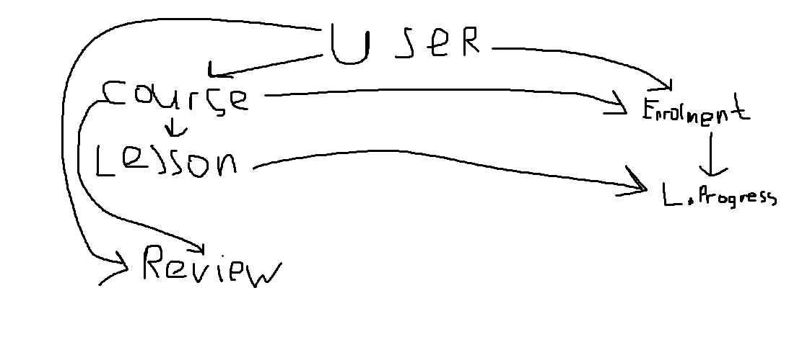
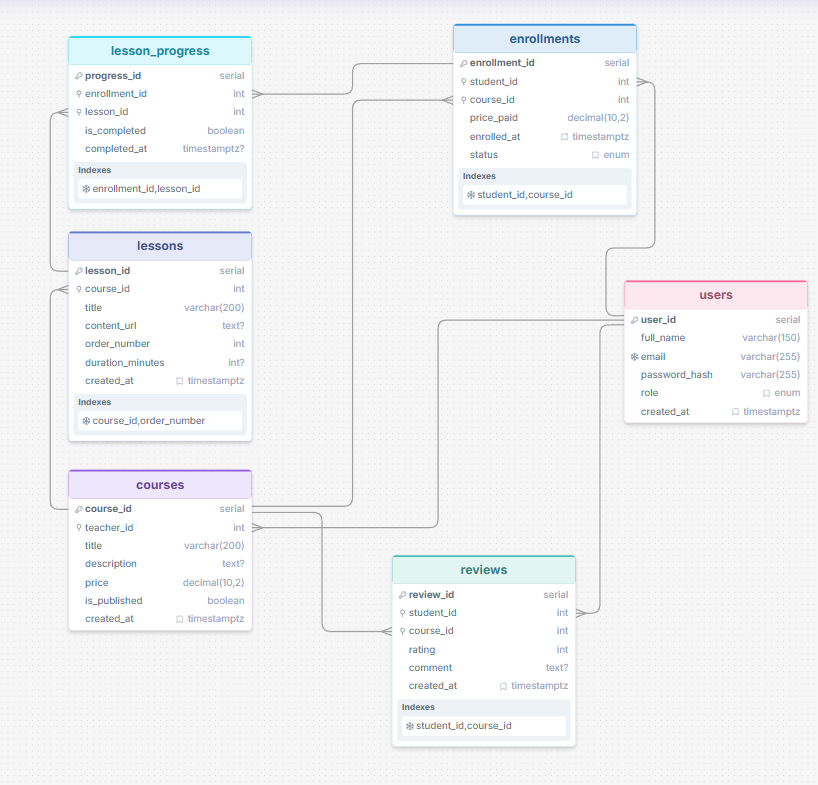

 # Домашнее задание №1. От бизнес-требований к физической модели
**Вариант №1: Онлайн-курсы (EdTech)**

---

## Задание 1. Концептуальная модель

### Описание сущностей и связей
* **User** — пользователи системы (студенты, преподаватели, админы).
* **Course** — образовательные курсы.
* **Lesson** — уроки в составе курсов.
* **Enrollment** — записи студентов на курсы.
* **Review** — отзывы и оценки курсов.
* **LessonProgress** — прогресс прохождения уроков.

---

## Задание 2. Логическая модель

### Типы связей и кардинальность
* `User` (1) <---> (N) `Course` (Преподаватель создает курсы)
* `User` (1) <---> (N) `Enrollment` (Студент покупает курсы)
* `User` (1) <---> (N) `Review` (Студент оставляет отзывы)
* `Course` (1) <---> (N) `Lesson` (Курс содержит уроки)
* `Course` (1) <---> (N) `Enrollment` (Курс имеет записи)
* `Course` (1) <---> (N) `Review` (Курс имеет отзывы)
* `Enrollment` (1) <---> (N) `LessonProgress` (Запись хранит прогресс)
* `Lesson` (1) <---> (N) `LessonProgress` (Урок отслеживается в прогрессе)

*Все связи являются неидентифицирующими (у каждой таблицы собственный PK).*

---

## Задание 3. Физическая модель (PostgreSQL)

Исходный код скрипта создания базы данных находится в файле [`schema.sql`](./schema.sql).

---

## Задание 4. Частые запросы к БД

1. **Каталог курсов:** Вывести все опубликованные курсы с именем преподавателя, ценой и средним рейтингом.
2. **Топ-10 курсов:** Найти 10 самых популярных курсов по количеству отзывов и высокой оценке.
3. **Уроки курса:** Показать все уроки конкретного курса в хронологическом порядке (`order_number`).
4. **История обучения:** Получить список купленных курсов студента и процент прохождения уроков.
5. **Доход преподавателя:** Рассчитать сумму продаж по курсам конкретного преподавателя за месяц.